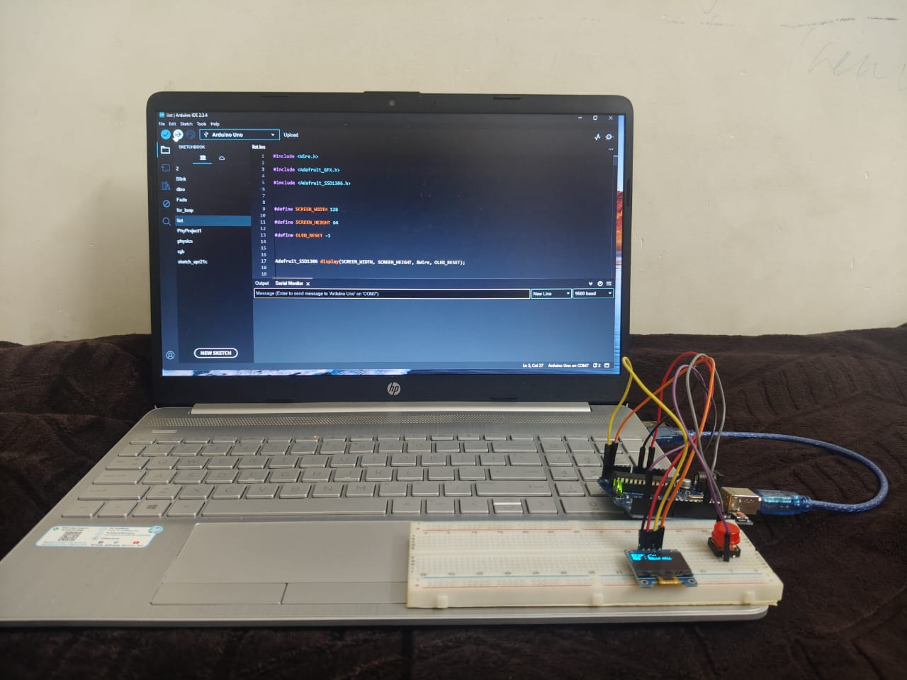
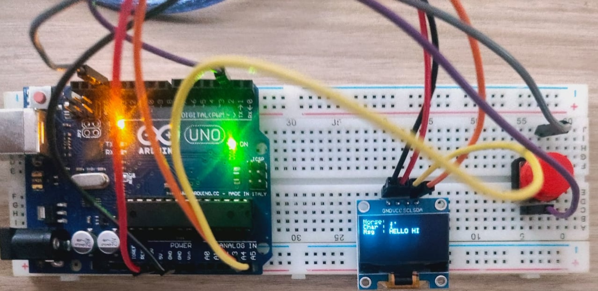

# Morse Code Decoder using Arduino and OLED Display

## Overview

This project implements a **Morse Code Decoder** using an Arduino, a push button, and a 128×64 OLED display (SSD1306). Users enter Morse code through button presses:

* **Short press (< 400 ms)** → Dot (`.`)
* **Long press (≥ 400 ms)** → Dash (`-`)

After a short pause, the entered Morse sequence is automatically decoded into an alphanumeric character and displayed on the OLED screen. The decoded characters are accumulated to form a complete message.

---

## Features

* Morse code input using a single push button.
* Automatic distinction between dots and dashes based on press duration.
* Supports:

  * Alphabets (A–Z)
  * Numbers (0–9)
* Real-time OLED display showing:

  * Current Morse sequence
  * Decoded character
  * Complete message
* Simple and low-cost implementation.

---

## Components Required

| Component                          | Quantity    |
| ---------------------------------- | ----------- |
| Arduino Uno/Nano                   | 1           |
| SSD1306 OLED Display (128×64, I2C) | 1           |
| Push Button                        | 1           |
| Breadboard                         | 1           |
| Jumper Wires                       | As required |

---

## Circuit Connections

### OLED Display (I2C)

| OLED Pin | Arduino Pin |
| -------- | ----------- |
| VCC      | 5V          |
| GND      | GND         |
| SDA      | A4          |
| SCL      | A5          |

*(For Arduino Uno. SDA and SCL pins may differ for other boards.)*

### Push Button

| Button Pin | Arduino Pin |
| ---------- | ----------- |
| One side   | D2          |
| Other side | GND         |

The program uses `INPUT_PULLUP`, so no external resistor is required.

---

## ibraries Used

Install the following libraries from the Arduino Library Manager:

1. **Adafruit GFX Library**
2. **Adafruit SSD1306 Library**
3. **Wire Library** (built-in)

---

## Working Principle

1. User presses the button.
2. Press duration is measured:

   * Less than 400 ms → Dot (`.`)
   * Greater than or equal to 400 ms → Dash (`-`)
3. Morse symbols are stored temporarily.
4. If no input is detected for 1 second, the sequence is decoded.
5. The decoded character is appended to the complete message.
6. OLED updates the current Morse code, decoded character, and full message.

---

## Supported Morse Codes

### Alphabets

| Letter | Morse |
| ------ | ----- |
| A      | .-    |
| B      | -...  |
| C      | -.-.  |
| D      | -..   |
| E      | .     |
| F      | ..-.  |
| G      | --.   |
| H      | ....  |
| I      | ..    |
| J      | .---  |
| K      | -.-   |
| L      | .-..  |
| M      | --    |
| N      | -.    |
| O      | ---   |
| P      | .--.  |
| Q      | --.-  |
| R      | .-.   |
| S      | ...   |
| T      | -     |
| U      | ..-   |
| V      | ...-  |
| W      | .--   |
| X      | -..-  |
| Y      | -.--  |
| Z      | --..  |

### Numbers

| Number | Morse |
| ------ | ----- |
| 0      | ----- |
| 1      | .---- |
| 2      | ..--- |
| 3      | ...-- |
| 4      | ....- |
| 5      | ..... |
| 6      | -.... |
| 7      | --... |
| 8      | ---.. |
| 9      | ----. |

---

## Applications

* Morse code learning tool
* Assistive communication systems
* Educational electronics projects
* Embedded systems practice

---

